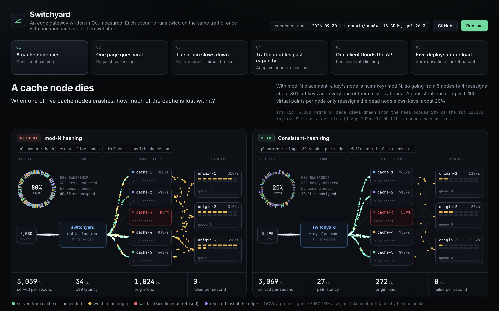

# Switchyard

[](https://github.com/Mohith26/switchyard/actions/workflows/ci.yml)

An edge gateway in Go, and a lab that shows what each of its parts is for.

Switchyard is a three-tier request path (**edge proxy → cache tier → origin pool**) with the mechanisms real CDNs and API gateways depend on: consistent hashing with bounded loads, request coalescing, stale-while-revalidate, retry budgets, circuit breakers, outlier ejection, adaptive concurrency limits, per-client rate limiting, hot config reload, and zero-downtime restarts by socket handoff. It uses only the Go standard library.

I built it to understand these mechanisms by watching a system fail without them, so every one of them can be switched off. The lab builds the whole topology on real sockets, replays real Wikipedia traffic through it, injects a failure, and records what every tier did at 100ms resolution. **Every scenario runs twice on identical traffic: once with one mechanism turned off, once with it on.** Each result below is a measured A/B comparison, and the dashboard replays both runs side by side.

**[Open the dashboard](https://mohithgajjela.com/system-02-switchyard)**, also mirrored on [GitHub Pages](https://mohith26.github.io/switchyard/). That page is a **recorded demo**: it replays runs recorded on my laptop and does not run the gateway. The gateway is this repository, and you can run the same dashboard locally with a *Run live* button:

```sh
go run ./cmd/switchyard lab serve     # http://127.0.0.1:8088
```



## Results

<!-- RESULTS:BEGIN (generated by `switchyard lab report`; do not edit by hand) -->

Recorded on an Apple M5 Pro laptop (darwin/arm64, 18 cores), 30 seconds per variant.

#### Consistent hashing: A cache node dies

The ring reassigned 20.1% of keys vs 80.3% for mod-N, cutting extra origin fetches from 7,844 to 1,949.

| Metric | mod-N hashing | Consistent-hash ring |
|---|---:|---:|
| Keys reassigned by the failure | 80.3% | 20.1% |
| Extra origin fetches after the crash | 7,844 | 1,949 |
| Peak origin load after the crash | 2,240/s | 570/s |
| Hit ratio, first 2s after the crash | 48.9% | 87.5% |
| p99 latency, first 5s after the crash | 32.51 ms | 26.37 ms |
| Failed requests after the crash | 0 | 0 |

#### Request coalescing + stale-while-revalidate: One page goes viral

Coalescing cut origin renders of the viral page from 187/s to 0.9/s, and hot-page p99 from 190ms to 1ms.

| Metric | Every miss fetches | Coalesced + stale-while-revalidate |
|---|---:|---:|
| Origin renders of the hot page | 187.2/s | 0.9/s |
| Hot page p99 latency | 190.46 ms | 1.23 ms |
| Hot page requests served | 94.5% | 100% |
| Background requests served | 99.9% | 100% |
| Peak origin queue | 226 | 0 |

#### Retry budget + circuit breaker: The origin slows down

With naive retries the system never recovered after the origin healed (0.0% served); with a retry budget and breakers it recovered in 0.5s (100.0% served).

| Metric | Naive retries | Retry budget + breaker |
|---|---:|---:|
| Requests served after the origin recovered | 0% | 100% |
| Time to recover after the origin healed | never | 0.5 s |
| Load amplification while slow | 3.87 x | 0.45 x |
| Load amplification after healing | 3.96 x | 0.97 x |
| Requests served while slow | 3.1% | 7.2% |
| Origin work thrown away | 40,175 | 3,198 |

#### Adaptive concurrency limit: Traffic doubles past capacity

At 2x capacity, goodput was 2,232 req/s with the adaptive limit (p99 38ms) vs 37 req/s without, where the p99 was 299ms.

| Metric | Queue everything | Adaptive concurrency limit |
|---|---:|---:|
| Goodput at 2x load | 37/s | 2,232/s |
| p99 of successful requests at 2x load | 299.01 ms | 38.4 ms |
| p50 of successful requests at 2x load | 219.14 ms | 21.76 ms |
| Requests refused fast | 0 | 25,109 |
| Origin work thrown away | 24,819 | 0 |

#### Per-client rate limiting: One client floods the API

During the flood, well-behaved clients got 100.0% of requests served with per-client limits vs 1.8% without.

| Metric | No per-client limit | Token bucket per client |
|---|---:|---:|
| Well-behaved requests served during the flood | 1.8% | 100% |
| Well-behaved p99 during the flood | 299.01 ms | 41.47 ms |
| Flood requests rejected at the edge | 0% | 89.6% |
| Average load reaching the origin during the flood | 5,165/s | 1,607/s |

#### Graceful restart (socket handoff): Five deploys under load

Five restarts failed 231 requests with stop-then-start and 0 with the socket handoff.

| Metric | Stop, then start | Socket handoff |
|---|---:|---:|
| Failed requests across 5 deploys | 231 | 0 |
| Success rate over the run | 99.691% | 100% |
| p99 latency over the run | 0.92 ms | 0.86 ms |
| Edge processes that served traffic | 6 | 6 |
<!-- RESULTS:END -->

`results/` holds the raw JSON for every run (both variants, every 100ms tick, every tier). Re-record them with `go run ./cmd/switchyard lab run` (about 7 minutes) and regenerate this section with `go run ./cmd/switchyard lab report`.

## How it fits together

```
                       ┌────────────── edge (internal/edge) ─────────────┐
 clients ── HTTP ──▶   │ per-client token bucket   → 429                 │
 (open-loop,           │ adaptive concurrency limit → fast 503           │
  Poisson,             │ placement: consistent-hash ring (160 vnodes,    │
  real Wikipedia       │   bounded loads) or mod-N                       │
  popularity)          │ active health checks + failover to ring successor│
                       │ hot reload (SIGHUP) · socket handoff (SIGUSR2)  │
                       └───────┬───────────────┬───────────────┬─────────┘
                               ▼               ▼               ▼
                 ┌──── cache node (internal/cachenode) × N ────┐
                 │ sharded LRU with TTL                         │
                 │ singleflight coalescing of concurrent misses │
                 │ stale-while-revalidate                       │
                 │ upstream client (internal/upstream):         │
                 │   P2C over peak-EWMA · circuit breaker per   │
                 │   origin · outlier ejection · retry budget · │
                 │   deadline propagation                       │
                 └──────────┬──────────────┬──────────────┬─────┘
                            ▼              ▼              ▼
                 ┌──── origin (internal/origin) × M ─────────────┐
                 │ W workers, bounded FIFO queue, lognormal       │
                 │ service time, no cancellation of abandoned work│
                 │ fault injection: slowdown, errors, hard kill   │
                 └────────────────────────────────────────────────┘
```

| Mechanism | Where | The idea in one line |
|---|---|---|
| Consistent hashing, bounded loads | `internal/ring` | Losing 1 of N nodes moves ~1/N of keys, not ~(N-1)/N; no node takes more than 1.25x the average load. |
| Request coalescing | `internal/cache/flight.go` | Concurrent misses for one key wait on a single upstream fetch. |
| Stale-while-revalidate | `internal/cachenode` | An expired entry keeps being served while one background refresh runs. |
| Retry budget | `internal/retry` | Retries may be at most 10% of requests (plus a small per-second floor), with jittered backoff. |
| Circuit breaker | `internal/breaker` | Sliding-window failure ratio; open fails fast, half-open admits a few probes. |
| Outlier ejection | `internal/health` | Consecutive failures eject an endpoint for an exponentially growing time, never more than a capped share of the pool. |
| P2C load balancing | `internal/balance` | Sample two endpoints, keep the one with the lower latency x queue-depth score. |
| Adaptive concurrency | `internal/limit/adaptive.go` | TCP-Vegas-style: shrink the in-flight limit when latency rises above the no-load baseline. |
| Per-client rate limit | `internal/limit/tokenbucket.go` | Sharded token buckets per client, with bounded memory. |
| Zero-downtime restart | `internal/graceful`, `cmd/switchyard` | The new process inherits the listening socket; the old one drains and exits. |
| Hot reload | `internal/edge` (`Apply`) | Validated config swapped atomically; in-flight requests finish on the old one. |
| Metrics | `internal/metrics` | Lock-free log-linear histograms (≤3% quantile error) and a Prometheus exporter. |

## Running it

**The lab and dashboard** (no setup beyond Go 1.23+):

```sh
go run ./cmd/switchyard lab list                        # the six scenarios
go run ./cmd/switchyard lab run -scenario retry-storm   # record one (about 1 minute)
go run ./cmd/switchyard lab serve                       # dashboard: replays plus live runs
go run ./cmd/switchyard lab export -out docs            # static, replay-only copy of the dashboard
go run ./cmd/switchyard lab export -single out.html     # the same, as one self-contained file
```

**As separate processes**, the way it would be deployed:

```sh
go build -o bin/switchyard ./cmd/switchyard
for i in 1 2 3; do bin/switchyard origin -listen :700$i -name origin-$i & done
for i in 1 2 3; do bin/switchyard cache -listen :900$i -name cache-$i -origins :7001,:7002,:7003 & done
bin/switchyard edge -config deploy/edge.local.json &

curl -i localhost:8080/wiki/Cleopatra                   # X-Cache: MISS, then HIT
bin/switchyard loadgen -target http://localhost:8080 -rate 2000 -duration 20s
kill -HUP  $(pgrep -f 'switchyard edge')                # hot reload
kill -USR2 $(pgrep -f 'switchyard edge')                # zero-downtime restart
curl -XPOST 'localhost:8001/-/fault?slowdown=4'         # slow origin-1 down (its admin port is +1000)
curl localhost:8080/-/metrics                           # Prometheus
```

**With Docker Compose** (3 origins, 3 caches, 1 edge):

```sh
docker compose up --build
docker compose --profile load run --rm loadgen
docker compose kill -s HUP edge
```

## Where it works, and where it doesn't

**Works:**
- **Platforms:** Linux and macOS, with Go 1.23+ or Docker. Tested on Apple Silicon macOS locally and on Ubuntu x86-64 in CI. Windows is not supported, because restarts use Unix signals and file-descriptor passing.
- **In front of any plain-HTTP server.** The cache node caches GET responses that send `Cache-Control: max-age` and passes everything else through. It never shares a cached response between requests that carry `Cookie` or `Authorization`. Use `-cacheable /static/,/assets/` to limit caching and coalescing to specific path prefixes.
  - `TestFrontsAGenericHTTPBackend` checks this against a server that knows nothing about Switchyard.
  - `examples/front-a-python-server.sh` does the same with the real binaries in front of a ten-line Python server. It covers MISS then HIT, no caching without Cache-Control, failover when the owning cache node is killed, and a zero-downtime restart during 400 requests with all 400 returning 200.
- **Deployment:** as separate processes (one binary per role) or as the Docker Compose stack.

**Does not work, or is out of scope:**
- **No HTTPS.** There is no TLS termination and no TLS to the origin. It speaks HTTP/1.1 only, with no HTTP/2 or QUIC.
- **One edge instance.** Rate limits and concurrency limits are per process, not global.
- **Simple cache.** It lives in memory, is sized by entry count, and starts empty after a restart.
- **It is not a production CDN.** It is a from-scratch implementation of the mechanisms one depends on, built to measure them.

## How the lab measures

- **Real sockets.** Every hop is a real HTTP/1.1 connection over loopback. In the deploy scenario the edge is a separate OS process running the real binary, restarted with real signals.
- **Real traffic shape.** Page views are drawn with the alias method from the 20,000 most-viewed English Wikipedia articles in the 12:00 UTC hour of 1 September 2024 ([Wikimedia pageview dumps](https://dumps.wikimedia.org/other/pageviews/2024/2024-09/)), embedded in `internal/trace/data`. The flash-crowd page, Sol Bamba, is the real top article of that hour. The footballer had died the day before, which is exactly the traffic spike being modeled.
- **Open-loop load.** Arrivals are Poisson at a scheduled rate and are sent whether or not earlier requests have returned. A closed-loop generator slows down when the system slows down, which hides the overload behavior being measured.
- **A capacity model that can actually fall over.** Each origin has 16 workers, a 2,048-deep FIFO queue and lognormal service times around 20ms, so 3 origins serve about 2,300 req/s. Like most real backends, it finishes work its caller has already abandoned. That is what makes a retry storm self-sustaining, so the lab can reproduce metastable failure instead of asserting it.
- **Exact window statistics.** Latency percentiles over a window come from merged histograms, not averaged per-tick percentiles. "Served" means a 200 within the client's 1s timeout.
- **Same seed, same traffic.** Both variants use the same arrival seed and fault schedule. Only the mechanism under test differs.

## What this does not claim

- Everything runs on one machine over loopback. There is no real network latency or packet loss, and absolute throughput is laptop-scale. The comparisons between variants are the point, not the raw numbers.
- The origin is simulated. Its capacity model is simple on purpose, and its parameters are in `internal/lab/catalog.go`.
- There is one edge instance, so rate limits and concurrency limits are per instance, not global.
- The adaptive limit at the edge sees end-to-end latency, including the cache hop. That is fine here because the origin is the bottleneck, but it would need per-route limits in a real deployment.
- Circuit breakers do not create capacity. In the retry-storm scenario both variants serve little while the origin is 4x slower. The difference is that one recovers the moment the origin does and the other never does.
- HTTP/1.1 only: no TLS termination, HTTP/2 or HTTP/3. Cache capacity is counted in entries, not bytes.

## Tests and benchmarks

```sh
go test -race ./...        # 61 tests, including process-level integration tests
go test -short ./...       # skips the tests that build the binary and spawn processes
go test -run '^$' -bench . -benchmem ./internal/...
```

The tests that matter most:

- `TestRemovingANodeMovesOnlyItsKeys`: every key that moves after a failure was owned by the dead node. The ring moves ~20% and mod-N ~80%.
- `TestCoalescingCollapsesConcurrentMisses`: 200 concurrent misses produce exactly 1 origin fetch.
- `TestBudgetCapsRetryRatio`: under sustained failure, retries stay within 10% of requests.
- `TestHotReloadUnderLoadDropsNothing`: 20 config swaps under 16 concurrent clients, 0 failed requests.
- `TestGracefulHandoffDropsNothing`: builds the binary, runs the edge as a real process, does 3 SIGUSR2 handoffs under 800 req/s, and asserts 0 failures and 4 distinct PIDs serving.
- `TestSIGHUPHotReload`: rewrites the config file, sends SIGHUP, and checks that the change is live in the same PID.

<!-- BENCH:BEGIN -->
| Benchmark (Apple M5 Pro, `go test -bench`) | Time per op | Allocations |
|---|---:|---:|
| Ring lookup, 16 nodes x 160 virtual points | 34.6 ns | 0 |
| Bounded-load ring lookup | 59.2 ns | 0 |
| Cache store hit, parallel | 49.0 ns | 0 |
| Per-client rate-limit check, parallel | 35.4 ns | 0 |
| Histogram record, parallel | 22.2 ns | 0 |
| Full cache-hit path over loopback HTTP (client, edge, cache node on one machine) | 19.9 us | 175 |

The last row works out to about 50,000 cache hits per second through both proxy hops, with the load generator sharing the same machine.
<!-- BENCH:END -->

CI (`.github/workflows/ci.yml`) runs vet, gofmt, the race-detector suite, the benchmarks, a shortened lab scenario, and a Docker Compose smoke test covering MISS then HIT through all three tiers, load, and a hot reload.

## Layout

```
cmd/switchyard/      one binary: edge, cache, origin, loadgen, lab
internal/edge/       rate limit, load shedding, placement, failover, hot reload
internal/cachenode/  cache node: LRU, coalescing, stale-while-revalidate
internal/upstream/   resilient client: P2C, breakers, outlier ejection, retry budget, deadlines
internal/ring/       consistent hashing with bounded loads; mod-N baseline
internal/cache/      sharded LRU store and singleflight group
internal/breaker/    circuit breaker
internal/retry/      naive and budgeted retry policies
internal/limit/      token buckets and the adaptive concurrency limit
internal/health/     active health checks and outlier ejection
internal/balance/    endpoints, round robin, least connections, P2C
internal/graceful/   listener inheritance for zero-downtime restarts
internal/origin/     simulated origin with fault injection
internal/loadgen/    open-loop Poisson load generator
internal/trace/      the embedded Wikipedia popularity trace
internal/lab/        topology builder, scenarios, recorder, dashboard (web/)
results/             recorded runs (JSON)
docs/                static dashboard export for GitHub Pages
```

## License

MIT
